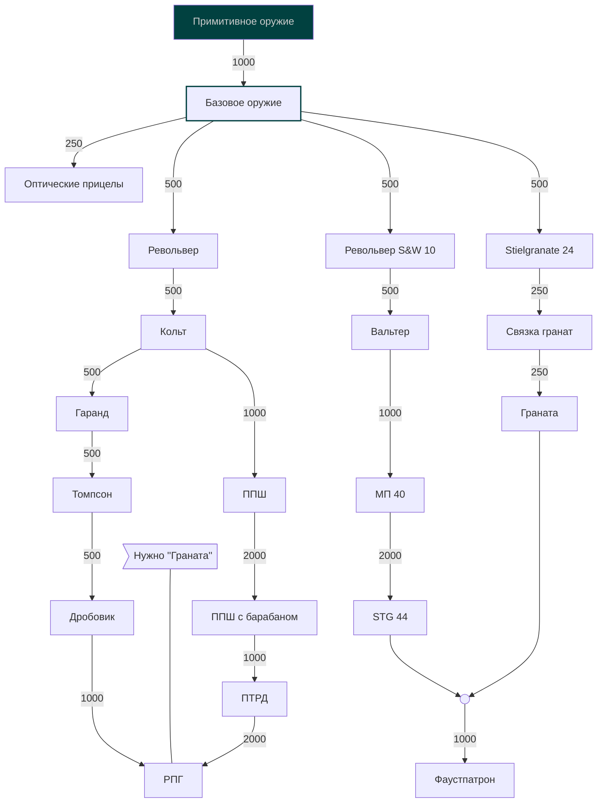

# PS-s
Так как этот документ будет редактироваться, я подробно распишу пункты которые посчитаю нужным расписать, а также укажу те фремворки с которыми работал, но в которых я слаб (FastAPI, например, очень мало работал).
Комментарии (прям комментарии) я буду помечать через стиль `code` & символ `#`
- Ps: Документ составлен честно, все детали и "нюансы" либо в открытых уточнениях(`(...)`), либо в комментариях `# ...`
- Ps: Я здесь НЕ указывал те пункты, с которыми я вообще не работал / просто что-то знаю.
- Ps: Если будет интересно (что маловероятно), мой профиль и мои проекты открыты для изучения прямо здесь же, на GitHub.
- Pps: В целом я бы себя причислил к Junior / Junior+ (так как бизнес задачи я ещё не умею решать быстро и эффективно в силу небольшого опыта), но самим программированием увлекаюсь с 8го класса, а всерьёз занялся на первом курсе, поэтому успел попробовать и поделать разное.

# Hard-skills (Technical Expertise)
### Языки программирования & Фреймворки
- **Python**: Django, Django Rest Framework, FastAPI (слабо), Pydantic, TeleBOT (Telegram-боты)
- **C#**: .NET 8+, WinForms (базовый)

### Работа с данными & Базы данных
- **Реляционные базы данных**: `# как основа для Django ORM`
	- Postgre SQL
	- SQLite
- **ORM**:
	- Django ORM (продвинутый, select / prefetch related (решение проблем N+1), агрегация, проектирование моделей)
- **Текстовые форматы данных**: (и где использовал)
	- **JSON** (API, конфиги, сериализация/десериализация данных)
	- **YAML** (прототипы Space Station 14 ([очень простой пример](https://docs.spacestation14.com/en/ss14-by-example/adding-a-simple-bikehorn.html#how-do-i-make-an-entity-and-give-it-components)))
	- **TOML** (конфиги)

### Архитектура & Методологии
- **Парадигмы**:
	- Объектно-ориентированное Программирование (ООП) (Инкапсуляция, Наследование, Полиморфизм, Абстракция)
- **Паттерны проектирования**: Стратегия, Фабричный метод, Наблюдатель, Адаптер, Синглтон, и другие.
- **Принципы и подходы**:
	- S.O.L.I.D
	- DI (Dependency Injection; как лучшая реализация DIP из SOLID)
	- DRY (Don't repeat yourself)
	- POLA (Principle of Least Astonishment / Приннцип наименьшего удивления)
- **Дизайн API**: REST API

### Технологии
- **Общие**:
	- Регулярные выражения (regex; работа с текстом)  `# средний ур., знаю основной синтаксис, всё сложное за меня делает ИИ, в 80% случаев использую для валидации через fullmathc`
	- Асинхронное программирование Async/Await (базовый уровень)  `# запускал задачи с бесконечными циклами внутри в C# (фактически многопоточность, а не async), немного поработал с asyncio и его корутинами, когда мне дали первую задачу с FastAPI (event loop), мы почти не используем эту технологию в проектах, почти всё у нас на синхронных WSGI серверах (синхронно обрабатывают запрос), что вполне отвечает требованиям поставленных задач (ASGI в основном используют в микросервисной архитектуре, так как там много I/O bound операций (запросов к другим сервисам), которые async-код позволяет выполнять параллельно, а не последовательно, это и есть его основное предназначение в любом ЯП)`
- **Web-backend**:
	- Аутентификация/Авторизация на JWT-токенах  `# делал в учебном проекте, всё работало хорошо, токены хранились в защищённых cookies`
	- WebSocket-ы (базовый ур.)  `# открывал и закрывал соединения, передавал текст и byte данные, мало работал (как и с FastAPI в целом)`
- **Web-frontend**: (вёрстка)
	- HTML (django-темплейты, сообщения telegram бота)
	- CSS (базовые стили, переменные)
	- XAML (UI в Space Station 14 ([пример](https://docs.spacestation14.com/en/robust-toolbox/user-interface.html?highlight=UI#xaml-ui)); из экосистемы .NET)

### Инструменты разработки & Окружение
- **Version Control**: GIT (средне-продвинутый уровень, создавал репозитории, ветки, делал коммиты, мёржил (объединял) ветки, разрешал конфликты, работал с несколькими удалёнными репозиториям разом, пушил изменения в удалённые репозитории, переносил коммиты между ветками через cherry-pich и многое другое), [GitHub](https://github.com/SpyDev14) (создавал репозитории, компании, делал форки, pull request-ы, работал с Open Source о чём ниже)
- **API Development & Тестирование**: Postman
- **IDEs**: Visual Studio (использую для C#; работал с WinForms-дизайнером), Visual Studio Code (использую для Python & PowerShell: знаю всякие прикольные фишечки, например могу пробросить порт на свой локально запущенный сервер в интернет через dev-tunnels, чтобы кто-то с другого компьютера мог зайти на сайт)  `# Но в последнее время и с C# работаю в VSC`
- **Автоматизация и Консоль**: PowerShell (аналог bash; пишу свои скрипты для работы; часто пользуюсь при работе в консоли)

### DevOps & Инфраструктура
- **Контейнеризация**: Базовый Docker  `# Именно базовый, могу в принципе написать простой dockerfile и запустить приложение в контейнере, но на этом всё`

### Документация
- Markdown (этот документ составлен с помощью него)
- Mermaid (язык разметки диаграм, работает вместе с Markdown)  `# Использовал для разметки древ технологий для полит. рп проекта в Scrap Mechanic "Хоум" (которые оказались не нужны и вообще он по итогу загнулся (дважды) из-за лени и глупости админов), идея была в реализации технологий для государств и отображении их прогресса через подобные диаграмы, которые очень легко собирать на основе данных в БД, выводить их планировалось через дискорд-бота (которого делал другой человек)`
- Obsidian (как md редактор и приложение для написании богатых заметок и документации в целом) `# Писал в нём диз-док для игры, а также пишу там MD-форматированные заметки, TODO-листы`

	
Пример диаграммы/древа технологий на Mermaid

### Тестирование
- **Python**: django-unittest, pytest `# с pytest мало работал, но это относительно небольшой и лёгкий фреймворк`

### Дополнительно
- **Game Dev**: Unity (начинающий), Unity Events  `# с UE мало работал, как и с событиями C# в принципе, но там в целом ничего сложного (для моего уровня), беру знание "в кредит" (можно подучить всё за 1 вечер), я так-то знаю как работают события и ивенты в C#, но ни разу толком с ними не работал (не делал проектов с ними, но с событиями в целом время от времени работаю, в том же Django и его сигналами).`
- **Open Source**: Принимал участие (когда было время) в разработке Space Station 14 ([Ru Corvax Wiki](https://station14.ru/wiki/Заглавная_страница), [Official site](https://spacestation14.com/))  `# не писал код, только редактировал UI и добавлял новый контент, описывая его на языке YAML (писал прототипы, уже упоминал выше), но тем не менее.`
- **Иностранные языки**: Английский язык (A2, пред-пороговый уровень)  `# если честно не знаю какой у меня уровень, везде пишут разное, но в целом говорить могу и документацию прочитаю, хотя читать буду долго, думаю это и есть A2`

# Soft-skills (Interpersonal & Cognitive Abilities)
### Коммуникация & Взаимодействие
- Вежливый и учтивый
- Умею слушать
- Владею навыками деловой переписки
- Положительно воспринимаю критику
- Учитываю бизнес-интересы  `# тут я имел ввиду что у меня нет маразма по поводу чистоты кода и прочего, я прекрасно понимаю что для простого сайта не нужна чистая, легко-масштабируемая архитектура. Всегда держу в голове то, что время = деньги, поэтому стараюсь не тратить время на ерунду. Тем не менее, сейчас я делаю проект и делаю его намеренно хорошо, так как мне: А - сказали делать хорошо, Б - никто не платит.`

### Когнитивные навыки
- Легко и быстро (обычно) осваиваю новое
- Активно пользуюсь нейросетями (для изучения нового / код-ревью / работы в целом)  `# Не уверен с расположением этого пункта именно здесь, но ИИ его определил сюда, я так и оставил. В целом, это точно soft навык т.к можно использовать в любой умственной работе.`
- Мыслю критически
- Осознанный (знаю чего хочу, думаю о будущем)  `# по сравнению со сверстниками уж точно, хотел от колледжа знаний, там этого не дали, поэтому очень рад что попал сюда.`
- Рефлексирую (делаю выводы, анализирую неудачи и проблемы, чтобы предотвратить их в будущем)
- Любопытный  `# постоянно спрашиваю разное у дипсика, даже не связанное с Python / Django (из последнего на 22.08.25 это был Entity Framework в C# (ORM)), регулярно расширяю кругозор (и не только в сфере IT, в свободное время люблю иногда смотреть хорошие науч-поп или исторические видео).`
- Амбициозный (стремлюсь к развитию в своей сфере)
- Креативный: генерирую много новых идей
- Инициативный
- Эмоционально устойчивый
- Оптимистичный

# Коммерческие проекты, с которыми я работал
$ Что это за проекты, краткая информация на 2-3 предложения.
## TLT Convector
- $ О задаче
- $ О проблемах в разработке
- $ О текущем состоянии

## LastTrainingProject?

## Personal GPT Assistant Bot
- $ О задаче
- $ О проблемах в разработке
- $ О командной работе
- $ О результатах
- $ О оценке
- $ О том, чтобы я там улучшил

# Open Source проекты

# Мои pet-проекты
## ConsoleGame
## TaskMnagerAPI
## BookMarketCourse
## SpaceForum
## TakeIt?
## PrototypeAssembler
## ShapeAreaCalculator
## WordCountFinder
## MyConsole
